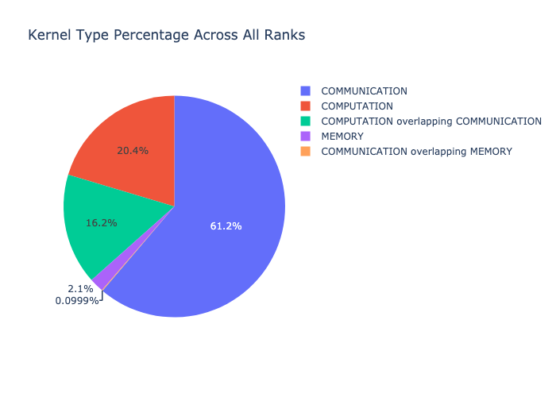
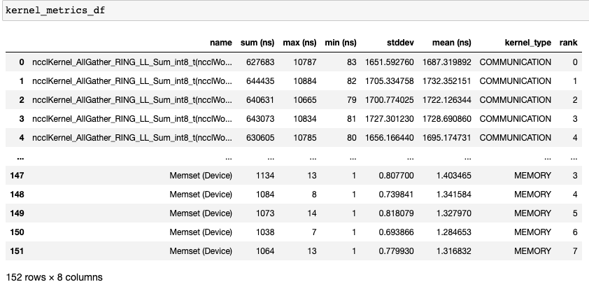

Kernel Breakdown
================

The kernel breakdown feature breaks down the time spent for each kernel type
i.e. communication (COMM), computation (COMP), and memory (MEM) across all
ranks and presents the proportion of time spent in each category. The
percentage of time spent in each category as a Venn diagram.

The kernel breakdown can be calculated as follows:

.. code-block:: python

   analyzer = TraceAnalysis(trace_dir = "/path/to/trace/folder")
   kernel_type_metrics_df, kernel_metrics_df = analyzer.get_gpu_kernel_breakdown()

The first dataframe returned by the function contains the raw values used to
generate the Venn diagram.

Kernel Duration Distribution
----------------------------

The second dataframe returned by `get_gpu_kernel_breakdown
<../api/trace_analysis_api.html#hta.trace_analysis.TraceAnalysis.get_gpu_kernel_breakdown>`_
contains duration summary statistics for each kernel. In particular, this
includes the count, min, max, average, standard deviation, sum and kernel type
for each kernel on each rank.

Using this data HTA creates many visualizations to identify performance
bottlenecks.

#. Pie charts of the top kernels for each kernel type for each rank.

#. Bar graphs of the average duration across all ranks for each of the top
   kernels and for each kernel type.

.. image:: ../_static/pie_charts.png

.. tip::
   All images other than the Venn diagram are generated using plotly. Hovering
   on the graph shows the mode bar on the top right which allows the user to
   zoom, pan, select and download the graph.

The pie charts above shows the top 5 computation, communication and memory
kernels. Similar pie charts are generated for each rank. The pie charts can be
configured to show the top k kernels using the ``num_kernels`` argument passed to
the `get_gpu_kernel_breakdown
<../api/trace_analysis_api.html#hta.trace_analysis.TraceAnalysis.get_gpu_kernel_breakdown>`_
function. Additionally, the ``duration_ratio`` argument can be used to tune the
percentage of time that needs to be analyzed. If both ``num_kernels`` and
``duration_ratio`` are specified, then ``num_kernels`` takes precedence.

.. image:: ../_static/comm_across_ranks.png

The bar graph above shows the average duration of the NCCL AllReduce kernel
across all the ranks. The black lines indicate the minimum and maximum time
taken on each rank.

.. warning::
   When using jupyter-lab set the "image_renderer" argument value to
   "jupyterlab" otherwise the graphs will not render in the notebook.

For a detailed walkthrough of this feature see the `gpu_kernel_breakdown
notebook
<https://github.com/facebookresearch/HolisticTraceAnalysis/blob/main/examples/gpu_kernel_breakdown_demo.ipynb>`_
in the examples folder of the repo.
